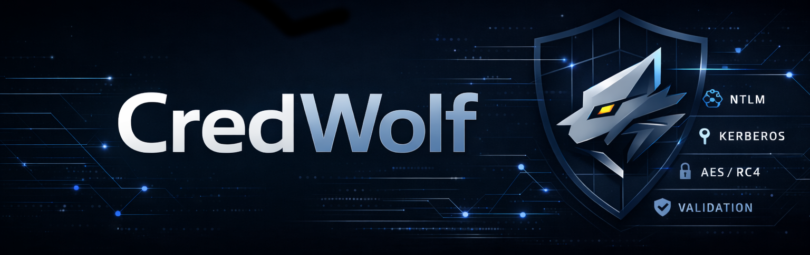

<p align="center">
  <a href="https://strongwind1.github.io/CredWolf/"></a>
</p>

<p align="center">
  <a href="https://github.com/StrongWind1/CredWolf/actions/workflows/ci.yml"></a>
  <a href="https://www.python.org/"></a>
  <a href="https://www.apache.org/licenses/LICENSE-2.0"></a>
  <a href="https://strongwind1.github.io/CredWolf/"></a>
</p>

<p align="center">
  <a href="https://strongwind1.github.io/CredWolf/getting-started/installation/">Installation</a> &bull;
  <a href="https://strongwind1.github.io/CredWolf/getting-started/quick-start/">Quick start</a> &bull;
  <a href="https://strongwind1.github.io/CredWolf/usage/ntlm/">Usage</a> &bull;
  <a href="https://strongwind1.github.io/CredWolf/reference/cli/">CLI reference</a> &bull;
  <a href="https://strongwind1.github.io/CredWolf/">Documentation</a> &bull;
  <a href="https://strongwind1.github.io/CredWolf/contributing/">Contributing</a>
</p>

Credential validation tool for Active Directory Domain Services.

CredWolf tests username and secret combinations (passwords, NT hashes, Kerberos keys, or ticket files) against a domain controller and reports which credentials are valid. It also supports username enumeration via Kerberos to discover valid AD accounts without causing login attempts. It is designed for authorized penetration testing, red team engagements, and security audits where you need to verify whether recovered or suspected credentials are active.

> **Warning:** This tool is intended for authorized security testing only. You must have explicit written permission from the system owner before testing credentials against any Active Directory environment. Unauthorized access to computer systems is illegal.

**[Full documentation](https://strongwind1.github.io/CredWolf/)**

## Features

- **NTLM + Kerberos** — validate credentials over SMB, LDAP, LDAPS, and Kerberos pre-authentication (UDP/TCP)
- **Every secret type** — passwords, NT hashes (bare + LM:NT), RC4 keys, AES128 keys, AES256 keys, and ticket files (ccache/kirbi with auto-detection)
- **Username enumeration** — discover valid AD accounts via Kerberos without triggering login failures or lockouts; ASREProastable accounts flagged automatically
- **Username case correction** — when using Kerberos AES authentication, the KDC returns the correct username casing in the salt. CredWolf detects this and uses the corrected name in all output
- **88+ credential permutations** — every meaningful combination of user sources, secret sources, encryption types, and transports
- **Paired files** — user:password, user:hash, and user:key files for pre-matched credential testing
- **Machine-parseable output** — `domain/user:secret@type` format, easy to grep or pipe
- **Safety-first errors** — clock skew stops execution immediately, per-user skip on unknown/revoked principals, detailed account status detection
- **Rate limiting** — `--delay`, `--jitter`, and `--max-lockouts` to avoid triggering lockout policies
- **Validation only** — no post-authentication activity by design

## Installation

```bash
pip install credwolf
# or
pipx install credwolf
# or
uv tool install credwolf
```

The `cw` command is also installed as a shorthand for `credwolf`.

See the [installation guide](https://strongwind1.github.io/CredWolf/getting-started/installation/) for source and Docker options.

## Quick start

```bash
# Validate a password over SMB
$ credwolf -d evil.corp ntlm --dc-ip 10.0.0.1 -u Administrator -p 'Password1!'
[+] evil.corp/Administrator:Password1!@password

# Validate an NT hash (pass-the-hash)
$ credwolf -d evil.corp ntlm --dc-ip 10.0.0.1 -u Administrator --hash 7facdc498ed1680c4fd1448319a8c04f
[+] evil.corp/Administrator:7facdc498ed1680c4fd1448319a8c04f@nt_hash

# Validate an AES256 key over Kerberos (pass-the-key)
$ credwolf -d evil.corp kerberos --kdc-ip 10.0.0.1 -u Administrator --aes256-key 9b12da6a4bdc263c1ac8f6302dc071e6e84321a263fa48784534b1ae43db2925 --transport tcp
[+] evil.corp/Administrator:9b12da6a4bdc263c1ac8f6302dc071e6e84321a263fa48784534b1ae43db2925@aes256_key

# Enumerate valid usernames (no login attempts, no lockout risk)
$ credwolf -d evil.corp userenum --kdc-ip 10.0.0.1 -U users.txt
[+] evil.corp/Administrator
[+] evil.corp/svc_backup — no_preauth (ASREProastable)
[*] Enumeration complete: 2/5 users found
```

See the full [usage guide](https://strongwind1.github.io/CredWolf/usage/ntlm/) and [CLI reference](https://strongwind1.github.io/CredWolf/reference/cli/) for all options.

## Supported protocols

| Protocol | Transport | Secret types |
|----------|-----------|--------------|
| **NTLM** | SMB (default), LDAP, LDAPS | Password, NT hash |
| **Kerberos** | UDP (default), TCP | Password, RC4 key, AES128 key, AES256 key, ticket (ccache/kirbi) |

## Development

```bash
git clone https://github.com/StrongWind1/CredWolf.git
cd CredWolf
uv sync                        # install dev dependencies
make check                     # run lint + typecheck + tests
```

See [CONTRIBUTING.md](CONTRIBUTING.md) for contribution guidelines.

## Credits

Built on [Impacket](https://github.com/fortra/impacket). Inspired by [CrackMapExec](https://github.com/byt3bl33d3r/CrackMapExec), [Kerbrute](https://github.com/ropnop/kerbrute), [smartbrute](https://github.com/ShutdownRepo/smartbrute), and [SprayHound](https://github.com/Hackndo/sprayhound).

## License

[Apache License 2.0](LICENSE)
